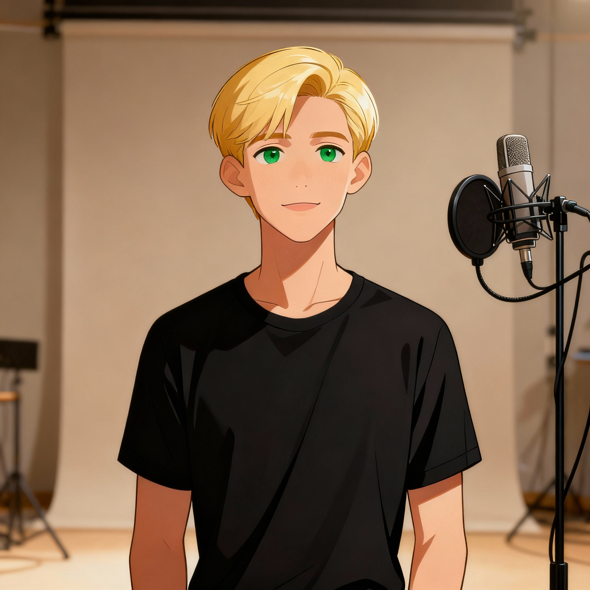

    preview do podcast

    <audio src="output/podcast_editado.MP4" controls title="Podcast editado"></audio>

# Projeto Podcast Gerado por I.A.s

Projeto com o objetivo de gerar um podcast utilizando ferramentas de IA através de prompts mais trabalhado.

## 💻 Tecnologias utilizadas no projeto

- [PerplexityIA](https://www.perplexity.ai/) 
- [ElevenLabs](https://beta.elevenlabs.io/)
- [Capcut](https://www.capcut.com/pt-br/)

## ✨ Como foi feito ?

- Roteiro gerado via perplexityAI
- Audio gerado pela elevenLabs
- PerplexityIA Para gerar capas
- Capcut para tratar aúdio e adicionar sons de fundo

## 🤖 Ganhe um mês de Perplexity IA Pro 
- https://plex.it/referrals/Q7MQCR6K

---

⌨️ com 💜 por [Mauricio Rodrigues]https://github.com/mauricioRodriguesDev
